# Section 1 - Getting Started w/ iOS 13 and Swift 5.1

-   App Developer program is just for launching apps fully. No need to get one until needed
-   App Store connect can be used to check analytics about the App

# Section 2 - Xcode Storyboards and Interface Builder

-   The 'Interface' Drop down in XCode's new project setup should be set to 'Storyboard'

## 18. A Walkthrough of the Xcode Development Environment

-   The document outline (appears when you click on an object that is in a storyboard) shows the different objects on the screen. This is basically where the layers exist
    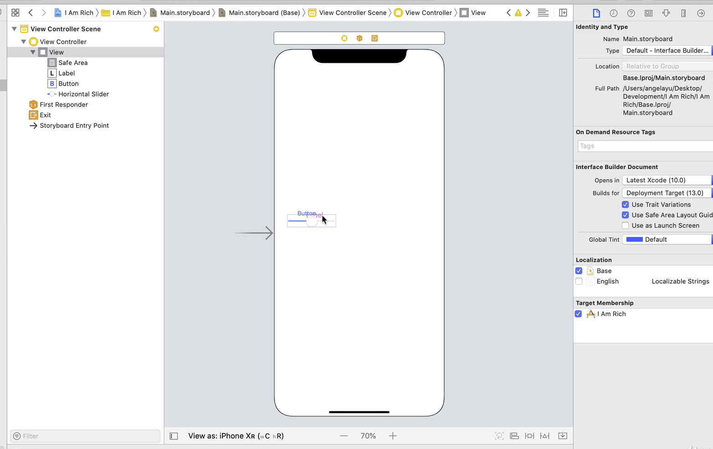
-   Look at the [XCode Shortcuts](https://swifteducation.github.io/assets/pdfs/XcodeKeyboardShortcuts.pdf) to improve efficiency
-   Right hand pane primarily used for different properties

## 19. Let's Design the User Interface

-   The 'View' (Located under the view controller) is basically the background of the app
-   Use [Colorhunt](https://colorhunt.co/) to figure out different palletes
    -   Makes it easy to design without having to actually design
-   Changing the X and Y coordinates for different objects aligns them onto a _graph_ onto an iPhone screen

## 20. Let's Incorporate some Image Assets

-   the 1x, 2x, and 3x image assets allow for scaling up for pixel sizes when necessary
-   Start with a 300x300 px size and scale down. Use the [App Icon Generator](https://appicon.co/#image-sets) to generate the different sized images

## 21. How to Design and Add an app icon

-   There is an App Icon generator at the above link to set up all the App Icons. Easy as dragging and dropping. XCode will figure it out itself
    -   AppIcon can be used to generate a whole new folder for the App Icon folder. This means we can just replace the assets folder and everything will be correctly placed
-   Designing a new app can be done using canva.com. Just need to use 1024x1024px

# Section 4 - Swift Programming Basics - Collections, Constants, Variables

-   'Scale to fill' fills the image view while 'aspect fill' fills the entire image view but keeps the aspect ratio intact
-   While holding the option key and clicking and dragging an object, the object is duplicated
-   To connect an object to the codebase, start by opening up the assistant view by clicking the dashes in the top right corner of the storyboard. The code file that matches the storyboard should pop up. To connect an object via code, hold the 'Control' key and drag and drop it into the code file

### Renaming Variables

-   Renaming variables/outlets is a bit more difficult than anticipated. Can't just change it in the code file because the connection that is created between the object in the design file and the code relies on that name. Rather than just changing the name, you'd have to disable the connection on the object in the design file.
-   A better way to do it though is right click on the variable that you want to change and click Refactor --> Rename
-   ImageLiteral can be used to change the value of an image. It is a small icon that you can see

## 40. Responding to User Interactions with IBActions

-   Buttons exist in the code file as actions. They create functions when an action (even in the properties) occurs
-   IB = Interface Builder

---

    print("Text \(2+3) Text")

-   The backslash allows for code to be inserted mid text
-   Variables are pretty consistent to other coding languages. Swift gives the user the ability to define their variable type using typescript notation
-   Range operator:
    -   '...' --> Inclusive of upper bound
    -   '..<' --> Not including upper bound

# Section 6 - Auto Layout and Responsive UIs

## 66. Setting Constraints and working with the Safe Area

-   These are the rules on how objects are laid out
-   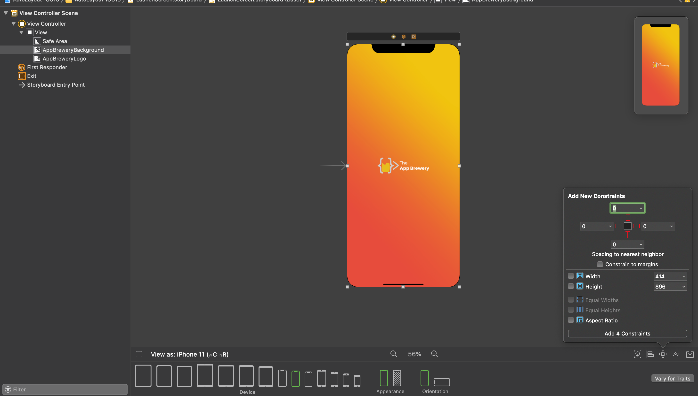
-   Clicking on the bottom right after selecting an object from the object viewer allows you to add constraints. In this case, we are adding constraints to the background image to be streched across the entire screen
-   'Safe Area' is a term that makes sure there is space for the home button and the swipe up feature. This is used to make sure that there are no buttons or CTA's in those areas. For backgrounds, we should strech it out all the way because there will be no interaction in those areas
-   For this situation, you want to change the Leading Alignment Constraint second item to Superview.trailing / Leading

## 67. How to use Alignment and Pinning

-   Constraints are like pinning an element by adding cosntraints defining the distance between our element and the containing view
-   Alignments are primarily used for vertical and horizantal aligment

## 68. Working with containers and subviews

-   We use containers to create new superviews in order to section off pieces of the screen
    -   Three ways to embed objects into a view:
        -   Insert an object called 'uiview' and realign values in the object viewer accordingly
        -   Click the objects you want to embed, click editor --> Embed in --> View
        -   Click object you want to embed, at the bottom right click on this small icon, embed, in view

## 69. Stack Views

-   In order to use alignment within containers, you need to use stack views. Reason being is because the containers need to be aligned as well
-   Stack view also needs constraints but this usually will be the entire screen safe area
-   Fixed width constraints are like setting px size in HTML. You can use ≥ width size to make sure min width is a thing

# Section 7 - Using and Understanding Apple Documentation

-   it's possible to link up multiple buttons to one IB Action
-   When deleting and renaming IBActions, make sure to reference this [link](https://stackoverflow.com/questions/24523086/xcode-interface-builder-correct-way-to-delete-rename-miswired-iboutlets-ib) to correctly get rid of the connections
-   '?' are optional strings. '!' are used for values that exist for sure. Need to do more research into optional strings

### Optionals

-   an optional data type allows 'nil' to be a value for that variable or constant
-   You should always check if an optional contains nil before using it
-   Before you can access the object of an optional variable or constant, you must first "unwrap" the optional. This means using the **'!'** character
-   There are different ways to check if an object exists (Is equal to nil)

    -   If Statement
        -   This is super tedious as you'd need to have an if statement for everything
    -   Optional Binding
        -   `if let actualPresent = present { print(actualPresent.surprise())}`
        -   Present is an optional in this case and if it is not nil, then actualPresent is assigned to deconstructed variable
    -   Optional Chaining
        -   `present?.surprise()`
        -   Basically the if statement in better syntax. Only if it is not nil, then do we run the code
    -   Nil Coalescing Operator
        -   `optional ?? default value`
        -   If the optoinal is not nil, use the optional, if it is optional, use the default value
    -   Optional Chaining
        -   `optional?.property`
        -   We want to access the properties and methods. This is used for classes and structs

-   Why do we use this? Forces the programmer to be more specific with their code

# Section 8 - Control flow and Optionals

-   You can manipulate the font size so it fits all screens and does not truncate by clicking on the label, and under properties, changing authoshrink to minimun font size and settign lines to 0
-   Equality operator is `==` double equal sign. Else if is `else if`. Most of the equality operators are the same as Python
-   Switch statements and dictionaries are also very similar to Python and other coding language
-   When you provide a key as a piece of text to retrieve an item out of a dictionary, you are provided with an optional. The reason being is because the key does not actually exist in the dict and a `nil` value is returned

# Section 9 - iOS App Design Patterns and Code Structuring

-   Creating structs is the same as other coding languages
    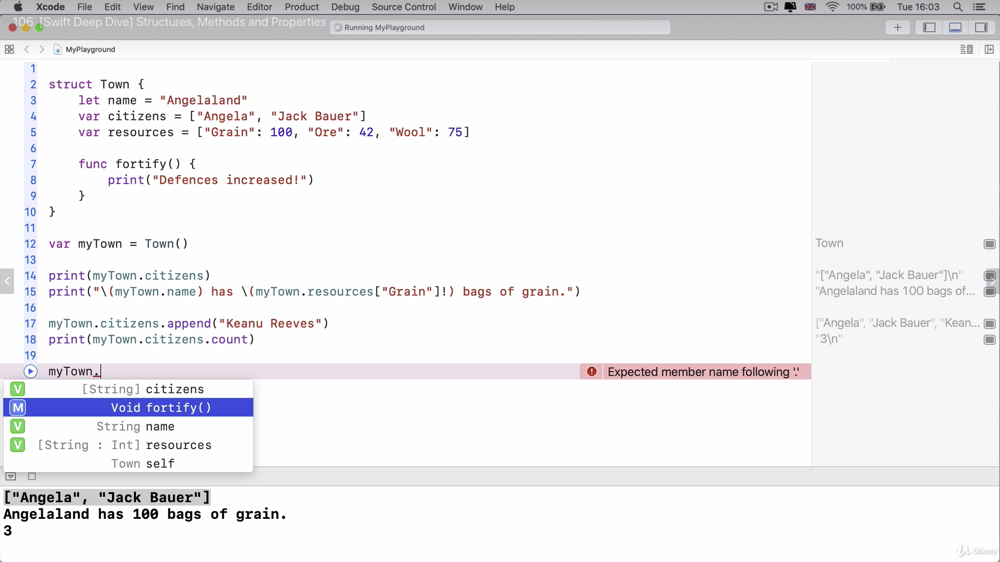
-   Constructors are changed to initializers and the keyword is `init` for this. When initializng, you need to add the parameter names
-   the `self` keyword refers to the eventual object that is created

### MVC Design Pattern

-   MVC Stands for Model View Controller
    -   Model
        -   This is the data & Logic
    -   View
        -   What goes onto the user interface
    -   Controller
        -   Mediator
        -   Should only be responsible for telling the other two what to do and responding to the changes in the view
-   View and Model never directly talk to each other. Always through the controller only
-   To make it so that I do not need to pass in the parameter name, then I need to create an external parameter name using the '\_' character in the function creation
-   When self is created in the background, it is created with the `let` keyword, which makes it immutable. So trying to change variables defined in a struct within the struct means the variables are immutable
-   If we're making a method that modifies one of the properties within the struct, then we have to mark the method as `mutating`

### Functions

-   To return something from a function, need to use a return type in the fucnction declaration
    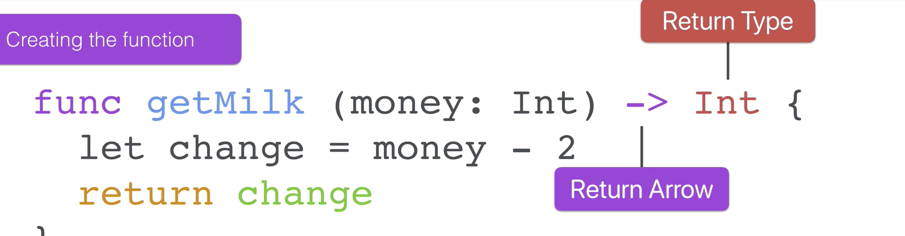

# Section 11 - Advanced Swift Programming - Classes, Inheritance, & Advanced Optionals

-   It's common practice to get an outlet and action from a slider or object. This way you can get access to the value and also know when the value changes

## 132 - 133. Classes, Inheritrance, and Structs vs Classes

-   The biggest difference between classes and structs is that classes can be inherited from a superclass
-   A superclass is the parent and a subclass is the child
-   Again, this is pretty basic to other languages. Classes can inherit from one another
-   Subclasses have the ability to override the parent class functions by using the `override` keywords
-   With overriding though, the functions have the ability to reference the parent class first and then add to it
    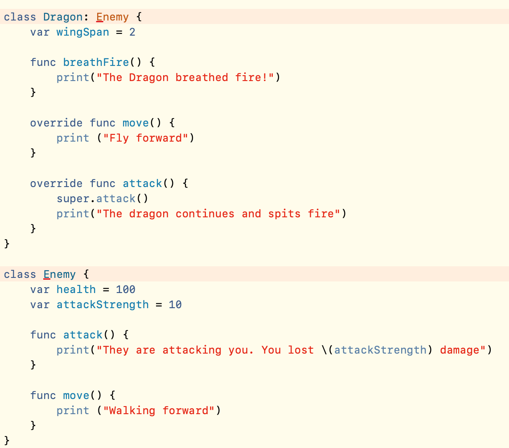
-   classes are **passed by reference**. Making a copy of an existing class makes a shallow copy basically. Structs are **passed by value**
-   Apple recommends using a struct over classes
-   Structs are immutable and passed by value while classes are passed by reference and utilize inheritrance

## 135. How to create UI Programatically and Pass data between ViewControllers

-   ## It is possible to create layouts programatically. But honestly why would this be done?
-   When creating another viewController, you can basically treat it like a class. This means I can assign values after making an instance of the class
-   The file type should be cocoa touch class when creating a viewController for an existing screen. Basically a shortcut to getting setup with view controllers instead of having to create the class when needed and whatever
    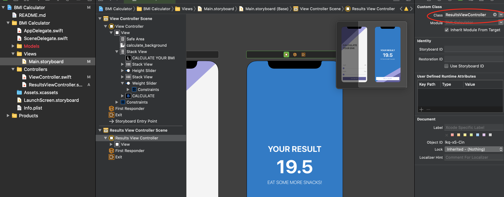
-   To link up a newly created view controller to a new class, you need to go the identity inspector and choose the class to equal the new controller class

## 136. Segues and Navigation for Multi-screen Apps

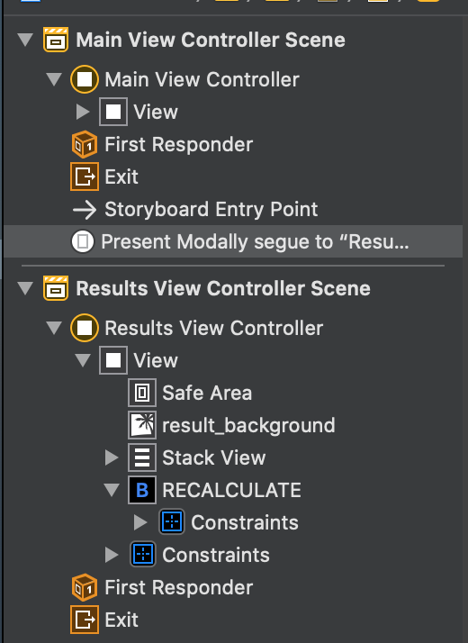

-   To create a segue between the screens, you have to hold the control key, drag from where you want to start to where you want to go
    -   Need to write something to identify it. This identifier is then used to make sure that the screens are in correct flow
        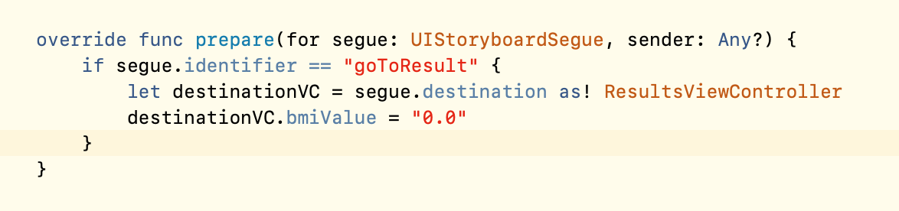
    -   Need to create a function like this. The reason we have an if statement is because there can be multiple segues from the same screen. We need to make sure that we are directing to the right screens.
-   The `view` property is always accessible

# Section 12 - Advanced Swift Programming Challenge

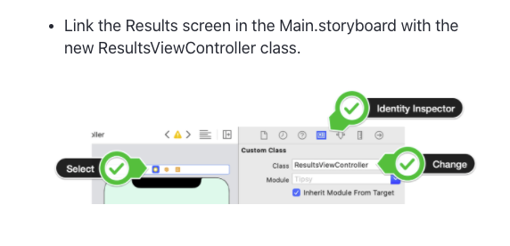

-   This is how to link classes to new view controllers

# Section 13 - Networking, JSON Parsing, APIs and Core Location

-   Create a new color set to make sure new colors are adjustable to light and dark mode
-   Can use vector images to replace background images. Vector images don't lose their pixel value

## 155. Learn to use UITextField

-   In order to get access to the keyboard, you have to import the UITextFieldDelegate
    -   UITextFieldDelegate allows you to manage the editing and validation of the text within the textField
-   When doing this, you need to set the delegate to self in order to get access to commands such as when the user clicks return on the keyboard

## 156. Protocols

-   Protocols are essentialy like certificates. Wherever they are called, that class or struct must be able to execute whatever is required within the protocol
-   Protocols can be used as a data type
-   By convention, we create the protocol in the same file as the class that will use the protocol
-   Protocols with default implementations (default using extensions) do not NEED to be created

## 161. Closures

-   To pass a function into another function, you would need to pass in the input parameters and the return value as a parameter
-   `func calculator (n1: Int, n2: Int, operation: (Int, Int) -> Int) -> Int`
-   Closures are anonymous functions
    -   Just remove the `func` keyword and name of the function, move the open bracket to the front of the function, and place the keyword `in` after the return value
        -   Ex. `{ (n1: Int, n2: Int) -> Int in ... }`
-   Since Swift can infer the data type from the variable, in closures, we actually don't need to pass in the data type of the parameters or the return value
    -   Going even further, you don't need to have the `return` keyword
    -   These are the same things but I don't need to go this deep
        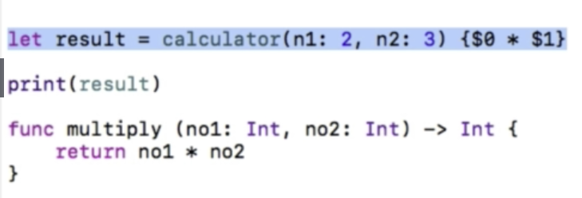
-   Closures allow you to package anonymous blocks of functionality and pass it around in your code
-   `{ (parameters) -> return type in statements }`
-   When calling functions within closures, you need to use the `self` keyword

## 162. JSON Decoding

-   JSON must be `Decodable` - A type that can decode itself from an external representation
    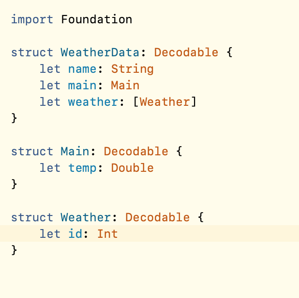

## 163. Computed Properties

-   Computed properties can be used instead of get functions basically. Syntax is `var <name> : <property type> { prreturn <value> }`

## 167. Updating the UI using the DispatchQueue

-   This is a specfic example that I'll eventually run into. Basically, when we're in a completion handler, we cannot update the UI. Instead, we must dispatch the call to update the label text to the main thread

## 168. Extensions and Default Implementations for Protocols

-   Extensions allow you to extend whatever properties or functions you want
    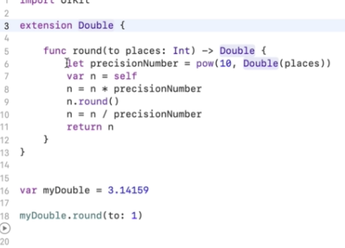
-   This gives us the capability to extend the double type so that we can round it to a certain place
-   Instead of adding all delegates to a single class and exteneding that class, you can create extensions of classes and add a single delegate to each extension. This allows for much cleaner code
